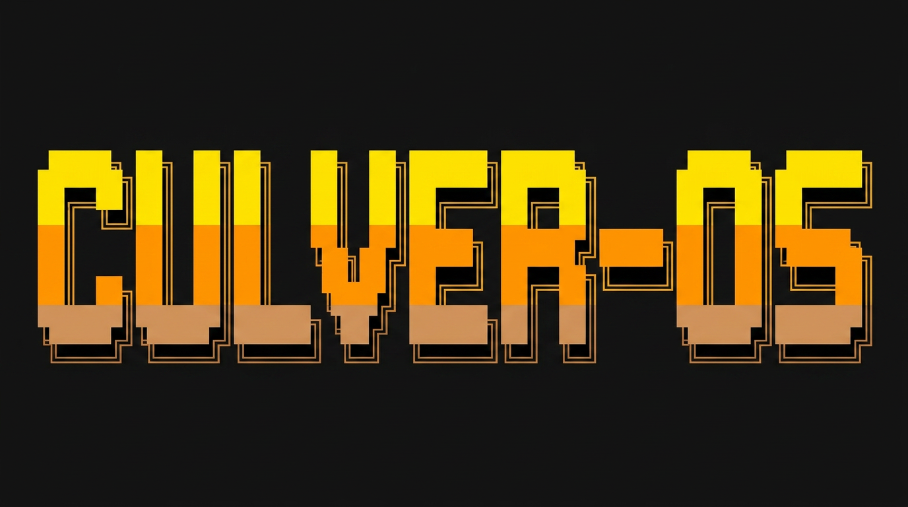

# CulverOS



**A Personal AI Operating System you can install in one command.**

CulverOS gives you a 24/7 personal AI agent running on your own VPS — with a semantic brain that knows your projects, your notes, and your commitments. Installed entirely through a conversation in Claude Code.

---

## What you get

- **Admin agent** — your personal AI, named by you, running 24/7 on Telegram
- **CulverBrain v3.0** — 6 memory layers: semantic knowledge base, interaction memory, action audit log
- **LLM-wiki** — automatic pipeline that converts your notes and sources into structured knowledge (inspired by [Karpathy's LLM-wiki](https://gist.github.com/RubenLovera/bdd39168ebf57ba3a116c63997d4abd0))
- **Two-vault architecture** — personal vault (your daily notes) + agent vault (AI-compiled wiki)
- **13 automated timers** — daily notes, vault ingestion, weekly planning, brain sync
- **Full ownership** — your VPS, your GitHub repos, your data

---

## Install

```bash
curl -fsSL https://raw.githubusercontent.com/RubenLovera/culver-os/main/install.sh | bash
```

Then open Claude Code and run:

```
/culver-onboarding
```

The onboarding wizard takes about 10 minutes and sets up everything.

---

## Prerequisites

- [Claude Code](https://claude.ai/code) installed (`npm install -g @anthropic-ai/claude-code`)
- A GitHub account with a Personal Access Token (repo + read:org scopes)
- A VPS running Ubuntu 24.04 — [Hostinger](https://hostinger.com) works well (~$4/mo)
- A Telegram account (for the bot)
- An LLM API key for the ingestion pipeline — Gemini (free at [aistudio.google.com](https://aistudio.google.com)), Claude, or OpenAI
- [Obsidian](https://obsidian.md) Desktop (recommended, for notes sync)

---

## How it works

```
curl | bash
  └── installs ~/.claude/skills/culver/ on your Mac

/culver-onboarding (Claude Code)
  ├── asks 10 questions
  ├── generates ~/.culver/config.json
  ├── creates your private GitHub repos
  ├── parametrizes all scripts + agents with your config
  └── calls /culver-bootstrap-vps

/culver-bootstrap-vps
  ├── installs docker + python on your VPS via SSH
  ├── starts ChromaDB + your admin bot (docker-compose)
  └── enables all 12 systemd timers
```

---

## CulverBrain — 6 memory layers

| Layer | Type | What it stores |
|-------|------|----------------|
| 1 | In-context | CLAUDE.md + agent identity |
| 2 | Procedural | MASTER_INDEX, status reports, user profile |
| 3 | Semantic | ChromaDB `{brain}_brain` — knowledge base from your wiki |
| 3b | Temporal | Daily notes filesystem — last 7 days |
| 4 | Episodic | log.md, session reports |
| 5 | Interactional | ChromaDB `{brain}_interactions` — your decisions & commitments |
| 6 | Actional | JSONL + ChromaDB `{brain}_actions` — everything the bots did |

---

## LLM-Wiki — How your agent learns about you

The LLM-wiki is the intelligence layer that makes your agent useful from day one.

```
You write in Obsidian (or anywhere)
     ↓
obsidian_sync connector copies notes to raw/
     ↓
vault-ingest.py (12:00 UTC daily):
  → reads raw/ files not yet in log.md
  → calls LLM → generates structured wiki pages in wiki/
  → updates MASTER_INDEX.md + log.md
  → pushes to GitHub (agent vault)
     ↓
vault-brain-sync.py (14:00 UTC daily):
  → detects changed wiki/ files via git diff
  → re-indexes into ChromaDB
     ↓
Your admin bot now knows what you wrote
```

**The difference from simple RAG:** your wiki *composes and accumulates*. RAG rediscovers from scratch each time. The wiki compounds — each entry links to related pages, and the agent can query it semantically.

**LLM-agnostic:** works with Gemini, Claude, or OpenAI. Configure once in `config.json`.

**Connectors extend what gets ingested:** Obsidian sync is pre-built. Notion, Gmail, GitHub, Granola → v1+. Build your own following `connectors/README.md`.

---

## Skills

| Skill | What it does |
|-------|-------------|
| `/culver-onboarding` | Full setup wizard |
| `/culver-bootstrap-vps` | Provision VPS + deploy runtime |
| `/culver-bootstrap-local` | Install local prerequisites |
| `/culver-healthcheck` | Check all services + timers |
| `/culver-daily` | Create today's daily note |
| `/culver-weekly` | Generate weekly review |
| `/culver-ingest` | Manually trigger vault ingestion |
| `/culver-add-connector` | Enable or build a data connector |
| `/culver-brain-sync` | Re-index vaults into ChromaDB |
| `/culver-connect-agent` | Connect your own bot to the brain |
| `/culver-uninstall` | Remove CulverOS from this machine |

---

## Architecture

```
Your Mac
├── Claude Code
│   └── ~/.claude/skills/culver/   ← skills (installed by this repo)
├── ~/.culver/config.json          ← your config (generated by onboarding)
└── ~/culver-os-{you}/             ← your private instance (GitHub repo)

VPS (24/7)
└── /root/culver-os/
    ├── agents/admin_bot.py        ← your admin agent (Telegram)
    ├── tools/brain.py             ← ChromaDB client
    ├── tools/memory.py            ← Layers 5 + 6
    ├── scripts/                   ← 12 automation scripts
    └── docker-compose.yml         ← ChromaDB + admin bot

GitHub (private)
├── {you}/culver-os-{you}          ← your parametrized instance
├── {you}/personal-vault           ← your daily notes (synced by Obsidian Git)
└── {you}/agent-vault              ← AI-compiled wiki + raw sources
```

---

## Adding your own agents

Any Python bot on the same VPS can connect to your brain in 3 lines:

```python
import sys
sys.path.insert(0, "/root/culver-os")

from tools.brain import query_filtered          # semantic search
from tools.memory import record_interaction     # Layer 5
from tools.memory import record_action          # Layer 6
```

Run `/culver-connect-agent` for a guided walkthrough.

---

## License

MIT